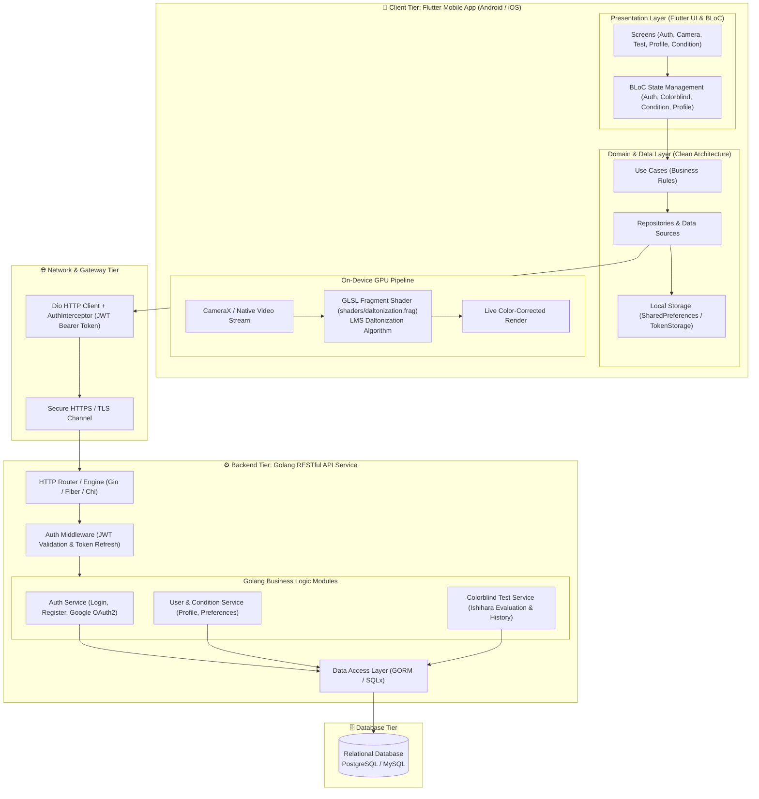

# ChromaLens 👁️🎨

**ChromaLens** adalah aplikasi mobile inovatif berbasis Flutter yang dirancang untuk membantu individu dengan defisiensi penglihatan warna (buta warna). Aplikasi ini mengintegrasikan tes buta warna klinis Ishihara, identifikasi kondisi penglihatan, profil adaptif, serta kamera koreksi warna *real-time* berbasis fragment shader dengan algoritma **LMS Daltonization**.

---

## 📋 Daftar Isi
- [Fitur Utama](#-fitur-utama)
- [Arsitektur Sistem & Integrasi Backend Golang](#-arsitektur-sistem--integrasi-backend-golang)
- [Spesifikasi Lingkungan Pengujian](#-spesifikasi-lingkungan-pengujian)
- [Panduan Instalasi](#-panduan-instalasi)
- [Cara Menjalankan Aplikasi](#-cara-menjalankan-aplikasi)
- [Akun Demo & Akses Pengujian](#-akun-demo--akses-pengujian)
- [Struktur Proyek](#-struktur-proyek)

---

## ✨ Fitur Utama
1. **Tes Buta Warna Ishihara**: Simulasi tes lempeng Ishihara digital untuk mendeteksi jenis dan tingkat sensitivitas defisiensi warna (Protanopia, Deuteranopia, Tritanopia, Monokromasi, atau Penglihatan Normal).
2. **Analisis Hasil Tes Dinamis**: Halaman hasil analisis yang memetakan skor, warna terdampak, diagnosis klinis, dan palet warna representatif sesuai model pengguna.
3. **Seleksi & Personalisasi Kondisi**: Alur onboarding seleksi kondisi untuk pengguna baru dengan sinkronisasi ke profil akun.
4. **Kamera Adaptif Daltonization**: Kamera *live preview* dengan fragment shader (`shaders/daltonization.frag`) untuk mengompensasi spektrum warna yang hilang secara *real-time*.
5. **Mode Offline**: Akses fitur utama tanpa ketergantungan koneksi server atau autentikasi akun.

---

## 🏗️ Arsitektur Sistem & Integrasi Backend Golang

Aplikasi **ChromaLens** dirancang dengan arsitektur modern berlapis (*Clean Architecture* berbasis fitur) di sisi *client* Flutter, yang terhubung ke layanan **RESTful API Backend berbasis Golang** untuk pemrosesan data terpusat, serta memanfaatkan *GPU hardware acceleration* untuk pemrosesan citra kamera *on-device*.

### 1. Diagram Arsitektur Tingkat Tinggi (High-Level System Diagram)



---

### 2. Alur Pembagian Beban Kerja (Hybrid Architecture)

Sistem menggunakan strategi komputasi hibrida:
- **Komputasi Grafis Lokal (On-Device GPU)**:
  Koreksi warna pada kamera dilakukan sepenuhnya di sisi perangkat menggunakan **OpenGL/Vulkan Fragment Shader (`daltonization.frag`)**. Hal ini menjamin performa tinggi (60 FPS tanpa latensi jaringan) dan menjaga privasi visual pengguna.
- **Komputasi Bisnis & Autentikasi (Backend Golang)**:
  Manajemen kredensial pengguna, enkripsi kata sandi (Bcrypt), verifikasi JWT, audit tes Ishihara, dan penyimpanan riwayat medis pengguna ditangani secara aman oleh **Golang Backend**.

---

### 3. Kontrak Endpoint API Backend Golang

Backend Golang menyediakan endpoint RESTful dengan format payload JSON standar:

| Endpoint | Method | Fungsi & Modul | Autentikasi |
| :--- | :---: | :--- | :---: |
| `/api/v1/auth/login` | `POST` | Autentikasi pengguna (email & password) -> Mengembalikan Access & Refresh Token | Publik |
| `/api/v1/auth/register` | `POST` | Pendaftaran akun baru | Publik |
| `/api/v1/auth/google` | `POST` | Verifikasi ID token Google OAuth2 & integrasi akun | Publik |
| `/api/v1/auth/refresh-token` | `POST` | Pembaruan Access Token yang kedaluwarsa | Refresh Token |
| `/api/v1/auth/password/forgot` | `POST` | Permintaan kode reset password via email | Publik |
| `/api/v1/auth/password/verify-code`| `POST` | Validasi kode verifikasi OTP reset password | Publik |
| `/api/v1/auth/password/reset` | `POST` | Reset password dengan kode verifikasi | Publik |
| `/api/v1/user/profile` | `GET` | Mengambil data profil pengguna & jenis kondisi penglihatan | Bearer JWT |
| `/api/v1/user/profile` | `PUT` | Memperbarui nama tampilan atau avatar | Bearer JWT |
| `/api/v1/user/condition` | `PUT` | Menyimpan jenis kondisi penglihatan terpilih | Bearer JWT |
| `/api/v1/user/settings` | `PATCH` | Memperbarui preferensi notifikasi dan bahasa | Bearer JWT |
| `/api/v1/tests/ishihara/plates` | `GET` | Mengambil daftar lempeng tes Ishihara aktif | Bearer JWT |
| `/api/v1/tests/ishihara/submit` | `POST` | Mengirim jawaban tes untuk evaluasi klinis | Bearer JWT |
| `/api/v1/tests/latest` | `GET` | Mengambil hasil evaluasi tes buta warna terbaru | Bearer JWT |
| `/api/v1/tests/history` | `GET` | Mengambil riwayat pengujian buta warna sebelumnya | Bearer JWT |

---

### 4. Format Respons Standar API (Envelope Pattern)

Semua respons dari backend Golang menggunakan pola format terpadu:

```json
{
  "success": true,
  "message": "Operasi berhasil",
  "data": {
    "access_token": "eyJhbGciOi...",
    "refresh_token": "eyJhbGciOi...",
    "user": {
      "id": 1,
      "email": "user@chromalens.app",
      "name": "ChromaLens User",
      "color_vision_type": "deuteranopia"
    }
  }
}
```

---

## 💻 Spesifikasi Lingkungan Pengujian

Untuk memastikan aplikasi dapat dibangun dan dijalankan dengan optimal, pastikan lingkungan pengembangan memenuhi spesifikasi berikut:

| Komponen | Spesifikasi / Versi yang Direkomendasikan |
| :--- | :--- |
| **Flutter SDK** | `^3.13.2` (atau Flutter versi 3.24.x / 3.27.x stable) |
| **Dart SDK** | `^3.13.2` |
| **Java Development Kit (JDK)** | OpenJDK 17 (LTS) |
| **Android SDK Platform** | Android 14 (API 34) atau Android 13 (API 33) |
| **Android Min SDK** | API 21 (Android 5.0 Lollipop) |
| **Target SDK** | API 34 |
| **Android NDK** | `30.0.16138531` |
| **Perangkat Uji Fisik** | Smartphone Android dengan kamera belakang & dukungan OpenGL ES 3.0+ (Sangat direkomendasikan untuk uji filter kamera) |
| **Emulator** | Android Emulator (x86_64 / arm64) dengan *Hardware Graphics Acceleration* aktif |

---

## 🚀 Panduan Instalasi

### 1. Kloning Repositori
```bash
git clone https://github.com/AstriaLfy/ChromaLens.git
cd chroma_lens
```

### 2. Konfigurasi Lingkungan Flutter
Pastikan Flutter telah terpasang di sistem dan periksa kelayakan *toolchain*:
```bash
flutter doctor
```

### 3. Unduh Dependensi Proyek
Unduh semua paket dependensi yang didefinisikan pada `pubspec.yaml`:
```bash
flutter pub get
```

---

## 📱 Cara Menjalankan Aplikasi

### 1. Hubungkan Perangkat atau Jalankan Emulator
Periksa daftar perangkat yang terdeteksi:
```bash
flutter devices
```

### 2. Jalankan Mode Debug
Jalankan aplikasi di perangkat target:
```bash
flutter run
```

> **Tips:** Tekan `r` di terminal untuk **Hot Reload** dan `R` untuk **Hot Restart**.

### 3. Pengujian Otomatis & Analisis Kode (Opsional)
Jalankan analisis kode statis:
```bash
flutter analyze
```

Jalankan rangkaian unit & widget test:
```bash
flutter test
```

---

## 🔑 Akun Demo & Akses Pengujian

Aplikasi telah dilengkapi mekanisme fallback cerdas (*dummy fallback*) dan mode offline sehingga pengujian dapat dilakukan baik saat backend online maupun saat tidak terhubung ke server backend.

### Opsi A: Mode Offline (Tanpa Perlu Login)
1. Buka aplikasi hingga tampil layar **Masuk**.
2. Klik tombol **Mode Offline** ("Masuk Tanpa Akun").
3. Anda akan langsung diarahkan ke **Homepage** dengan izin kamera aktif dan preferensi lokal.

### Opsi B: Login Demo (Backend / Local Fallback)
Gunakan kredensial pengujian berikut untuk mencoba alur login:
- **Email**: `user@chromalens.app` *(atau email valid lainnya)*
- **Kata Sandi**: `password123` *(minimal 6 karakter)*

> **Catatan Alur Akun Baru vs Akun Lama:**
> - **Akun Baru (Login Pertama Kali)**: Setelah berhasil masuk, aplikasi secara otomatis mengarahkan Anda ke halaman **Pilih Kondisi Penglihatan (`/select_condition`)**. Setelah Anda memilih dan menyimpan kondisi, Anda akan masuk ke Beranda.
> - **Akun Lama (Login Berikutnya)**: Jika Anda keluar (logout) dan masuk kembali dengan email yang sama, data kondisi Anda akan dipulihkan dan aplikasi langsung membuka **Beranda (`/home`)**.

### Opsi C: Registrasi Akun Baru
Anda juga dapat membuat akun baru melalui tautan **"Daftar"** di bagian bawah layar masuk:
- Masukkan Email: `testuser@gmail.com`
- Masukkan Kata Sandi & Konfirmasi Kata Sandi (min. 6 karakter).
- Klik **"Daftar"** untuk langsung diarahkan ke halaman konfigurasi kondisi.

---

## 📂 Struktur Proyek

```text
lib/
├── app/
│   └── config/
│       └── router.dart                 # Konfigurasi rute & navigasi aplikasi
├── core/
│   ├── constants/                      # Konstanta tema, warna, endpoint API
│   ├── di/                             # Dependency Injection (GetIt)
│   ├── network/                        # HTTP Client (Dio) & Interceptor
│   ├── storage/                        # Penyimpanan token & preferensi (SharedPreferences)
│   └── theme/                          # Definisi tema Material Design
├── features/
│   ├── auth/                           # Fitur Login, Register, Lupa Sandi, Google Sign-In
│   ├── camera/                         # Kamera real-time & Daltonization Shader
│   ├── colorblind_test/                # Tes Buta Warna Ishihara & Hasil Analisis
│   ├── homepage/                       # Beranda & status profil penglihatan
│   ├── navigation/                     # Bottom navigation shell
│   ├── profile/                        # Profil pengguna & detail riwayat tes
│   └── select_condition/               # Layar pemilihan jenis kondisi buta warna
├── main.dart                           # Titik awal aplikasi (Entry Point)
└── shaders/
    └── daltonization.frag              # Fragment shader LMS Daltonization
```

---

## 📄 Lisensi
Hak Cipta © 2026 Tim Pengembang ChromaLens. Seluruh hak cipta dilindungi undang-undang.

